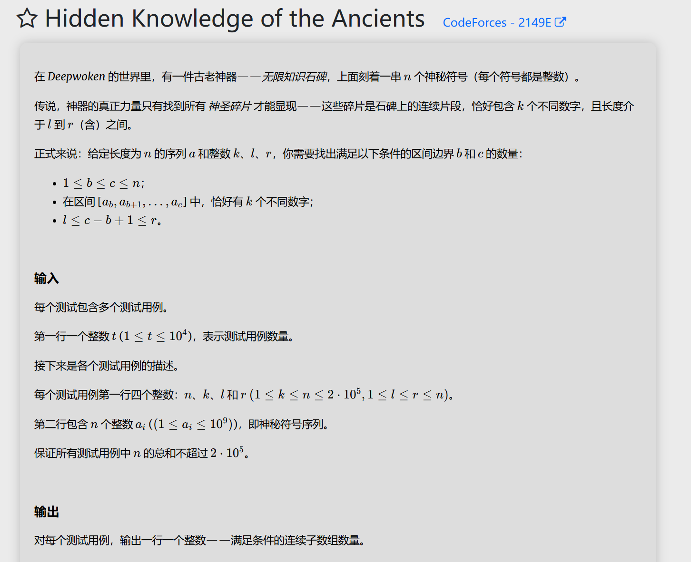

# 代码
```
#include<bits/stdc++.h>
using namespace std;

void solve(){
	int n,k,l,r;
	cin>>n>>k>>l>>r;
	vector<long long> a(n);
	for(long long &x:a){
		cin>>x;
	}
	map<long long,long long> cnt1,cnt2;
	long long ans=0;
	int x=0,y=x;
	cnt1[a[0]]++;cnt2[a[0]]++;
	for(int i=0;i<n;i++){
		while(x<n&&cnt1.size()<k){
			x++;
			cnt1[a[x]]++;
		}
		while(y<n&&cnt2.size()<=k){
			y++;
			cnt2[a[y]]++;
		}
		ans+=max(0,min(y-1,i+r-1)-max(x,i+l-1)+1);
		if(cnt1[a[i]]==1){
			cnt1.erase(a[i]);
		}else{
			cnt1[a[i]]--;
		}
		if(cnt2[a[i]]==1){
			cnt2.erase(a[i]);
		}else{
			cnt2[a[i]]--;
		}
	}
	cout<<ans<<"\n";	
}
int main(){
	int t;
	cin>>t;
	while(t--){
		solve();
	}
	return 0;
}
```

# 思路
我还是觉得这一题有点厉害，很巧妙的把 $O(n^2)$ 的时间复杂度转化为 $O(n)$ 时间复杂度。因为我们的i x y三个指针都只增不减，只增不减，只增不减。

巧妙的运用了k的只增不减的性质。