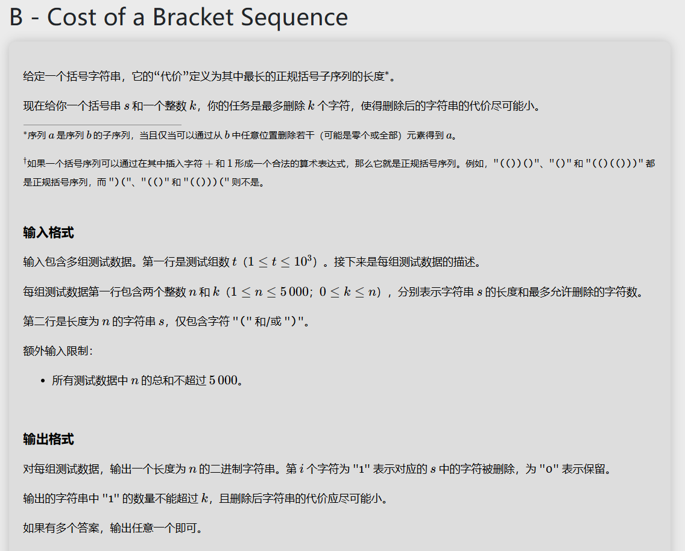

# 思路讲解
## 求出原序列的最长正规括号子序列
$$
P = \min_{i}\{perfOpen[i]+suffClose[i]\}
$$
其中$perfOpen[i]$是指在标号$i$之前左括号的个数，$suffClose[i]$是指在标号$i$之后右括号的个数,$P$为最长正规括号配对数。
### 1.证明$P \leq \min_{i}\{perfOpen[i]+suffClose[i]\}$

对于任意的下标$i$，每个配对要么左括号在$i$左侧，要么右括号在$i$右侧，或者都满足，故左边左括号的个数加上右边右括号的个数一定大于最大的配对数，即$\forall x,i$，s.t.
$$
P_x \leq prefOpen[i] + suffClose[i]     
$$

其中$P_x$为配对方式为$x$的配对数
### 2.证明$P$可以取到等号

那么需要证明的即是，$\exists 配对x$,s.t.
$$
P = \min_{i}\{perfOpen[i]+suffClose[i]\}
$$

我们可以按照顺序来找配对，每次把 “)” 与左侧最近的 “(” 配对，可以证明这样寻找到的配对数是最大的。那么
$$
P = totalColse - (-\min_{i}balance[i])
$$
其中$totalClose$为总共右括号的个数，$-balance[i]$为在$i$前无法配对 ")" 的个数。定义$$
balance[i] \overset{def}{=} prefOpen[i]-prefClose[i]
$$
故
$$prefOpen[i]+suffClose[i]=prefOpen[i]+(totalClose−prefClose[i])=totalClose+balance[i]$$
对等式同时取最小值，可得
$$\min_{i}​(prefOpen[i]+suffClose[i])=totalClose+\min_{i}​balance[i]$$
此时的配对方式取得最大值。

## 官方题解
