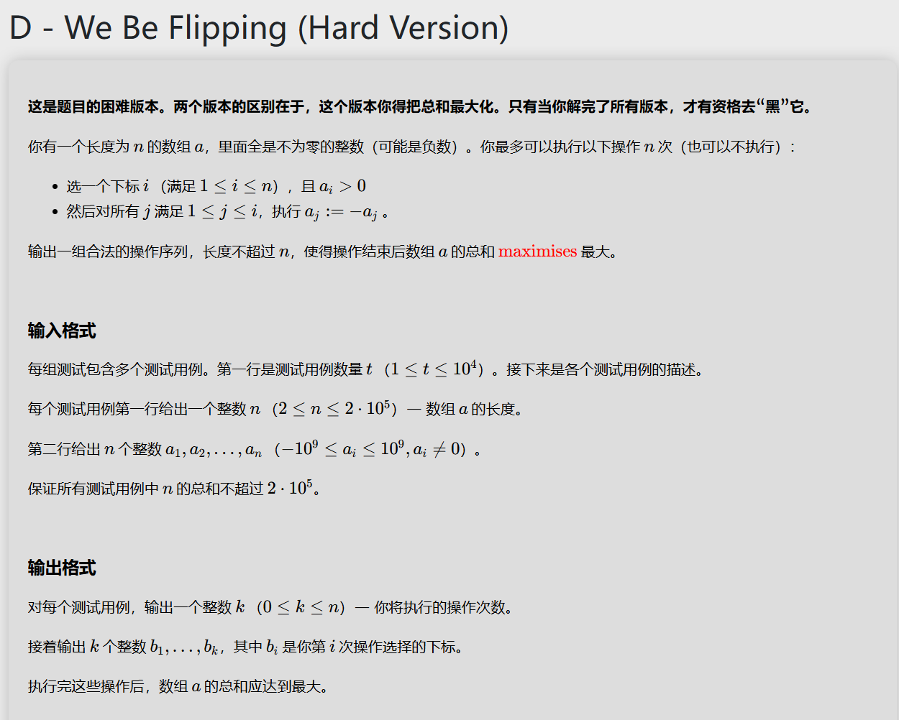

# 代码
## 构造
```
#include<bits/stdc++.h>
using namespace std;
long long a[200050],lowsum=0,max1=0,index=-1;
int ans[200050],print[200050],start=0,end1=0;
int pop(){
	return print[start++];
}
void push(int n){
	print[end1++]=n;
}
int main(){
	int t;
	cin>>t;
	while(t--){
		int n;
		start=0;end1=0;index=-1;max1=0;lowsum=0;
		cin>>n;
		for(int i=1;i<=n;i++){
			cin>>a[i];
			if(a[i]<0){
				ans[i]=-1;
				lowsum+=-a[i];
			}else if(a[i]>0){
				ans[i]=1;
				if(lowsum-a[i]>max1){
					max1=lowsum-a[i];
					index=i;
				}
			}
		}
		if(index==-1){
			cout<<0<<"\n";
			cout<<"\n";
		}else{
			int i=index-1,j;
			while(i>0&&ans[i]==-1){
				i--;
			}
			j=i;
			while(i>0&&j>0){
				push(i);
				while(ans[j]==ans[i]&&j>0){
					j--;
				}
				i=j;
			}
			cout<<end1-start+1<<"\n";
			while(start<end1){
				cout<<pop()<<" ";
			}
			cout<<index<<"\n";
		}
		
		
	}
	
	return 0;
}
```

# 思路讲解

可以发现，对同一个地方变换两次和交换变换的顺序（前提是交换后仍可变换）均不会对结果产生影响，故 $n$ 次变换的限制对我们没有影响。

而我们一定可以把某一个正数之前的所有内容全部变为负数，然后用后面的一个正数把前面的所有内容都变为正数，自己变为负数，因此我们可以找到一个位置，使得这个位置的正数比前面所有的负数加起来都要大，那么这个变换就是有收获的，然后遍历一遍找到最大值，再构造一个变换序列即可。