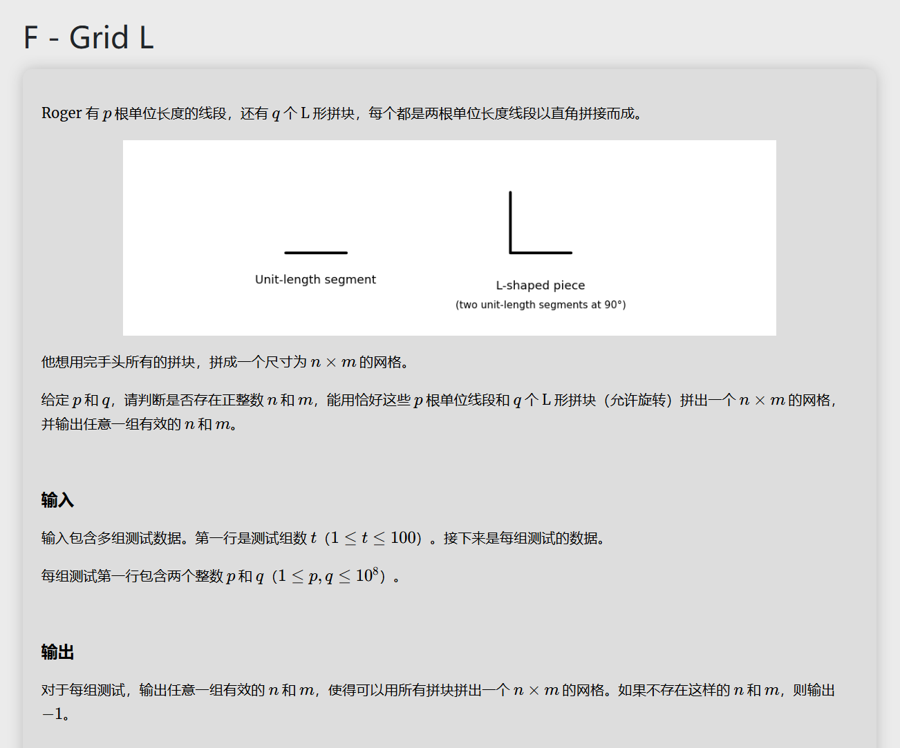

# 代码
```
#include<bits/stdc++.h>
using namespace std;
long long sqrtl(long long x){
	long long left=0,right=x,mid;
	while(left+1<right){
		mid=(left+right)/2;
		if(mid*mid==x){
			break;
		}else if(mid*mid>x){
			right=mid;
		}else{
			left=mid;
		}
	}
	return right;
}
int main(){
	int t;
	cin>>t;
	while(t--){
		long long p,q,c;
		cin>>p>>q;
		c=p+2*q;
		
		int MAX=(1+sqrtl(1+2*c))/2,m=-1,n=-1;
		for(int i=2;i<=MAX;i++){
			if((c+i)%(2*i-1)==0){
				n=i;m=(c+i)/(2*i-1); 
				if(q<=min(n*(m-1),m*(n-1))){
					break;	
				}else{
					m=-1;n=-1;
				}
				
			}
		} 
			
		if(n*m==1){
			cout<<"-1\n";
		}else{
			cout<<n-1<<" "<<m-1<<"\n";
		}
		
		
		
	}
	
	
	
	return 0;
} 
```

# 思路
首先寻找条件：

我们可以发现 $n \times m$ 的网格内一共有 $2mn+(m+n)$ 条边，并且可以发现这个边数并不是取遍所有所有自然数，故我们可以先寻找一个 $m,n$ 使得利用两种边一共的边数 $p+2q=2mn+(m+n)$ 。

根据给的数据范围可以知道边数一共是有$3 \times 10^8$ 的大小，因此我们数据类型得用**long long**长整型，而遍历的 $n$ 会要到 $n=\frac{c-m}{2m+1} \leq c$ 这个时间复杂度到了 $10^{8+2}$ ，这是不可以接受的，于是我们可以通过 $m,n$ 的对称性只遍历 $m \leq n$ 的情况，于是把 $m=n$ 带入可以解得 $MAX$ 。再从 $m \in [1,MAX]$ 中遍历即可。

提交发现WA，寻找反例（1，6）对应的 $m \times n$ 为 $1 \times 4$ 。尝试手动匹配，不行，发现每一个L型边都需要一共横边和竖边，而我们的反例中竖边少了，于是再在后面加一个判断，需要L型边的个数小于横边和竖边的最小值，AC。