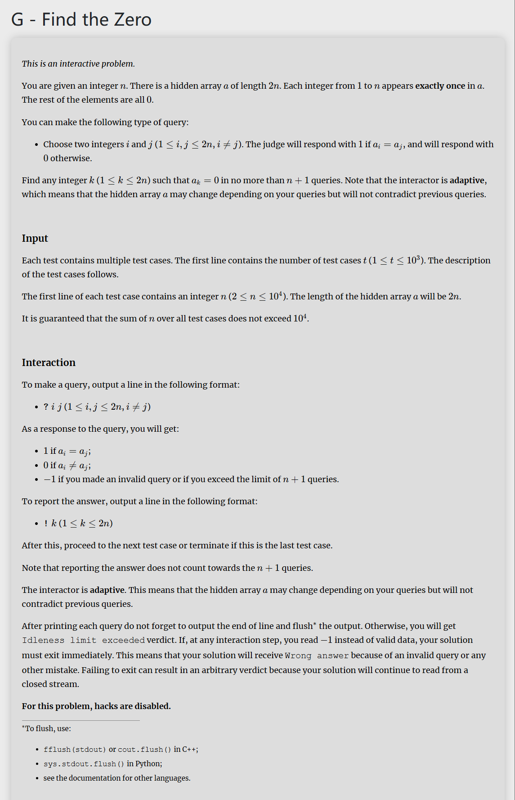

# 代码
```
#include<bits/stdc++.h>
using namespace std;
int main(){
	int t;
	cin>>t;
	while(t--){
		int n,a,k=-1;
		cin>>n;
		for(int i=1;i<n;i++){
			cout<<"? "<<2*i-1<<" "<<2*i<<"\n";
			cin>>a;
			if(a==1){
				k=2*i;
				break;
			}
		}
		if(k==-1){
			cout<<"? "<<2*n-2<<" "<<2*n<<"\n";
			cin>>a;
			if(a==1){
				k=2*n;
			}else{
				cout<<"? "<<2*n-3<<" "<<2*n<<"\n";
				cin>>a;
				if(a==1){
					k=2*n;
				}else{
					k=2*n-1;
				}
			}
		}
		cout<<"! "<<k<<"\n";
		cout.flush();
		
		
		
	}
	
	
	return 0;
} 
```

# 思路讲解
我们可以发现，由于非零数字只出现一次，因此若找到相同的两个数字，那么这两个一定都是零。所以我们的目标就是找到两个相同的数字。

那么我们只要 $n+1$ 次询问，怎么询问 $2n$ 个数字呢，很自然的想到两两组队即可，然后我们想想最糟糕的情况是什么： $2n$ 个数字都查询完了，但是还是没有找到相同的，那我们想想此时的数据情况是什么，是不是每一对里面都有一个零，那么找到对于两组 (X,0)和(Y,0)只需要两次询问就可以找到零。

但是此时我们的询问次数达到了 $n+2$ 次，这个超过了我们的最大询问次数，于是我们的目标变成了怎么在这个基础上减少一次询问。

让我们尝试不进行最后一对的询问，那么我们分析一下这种方式下会有什么情况：
1. 最后一组是（X，0）
	那么此时和上面写的方法一样
2. 最后一组是（0，0）
	那么前面的有一组是（X，Y），我们惊奇的发现对这一种情况进行上面的方法同样可以找到零
于是，我们便得到了解决方法。实现代码，然后AC。