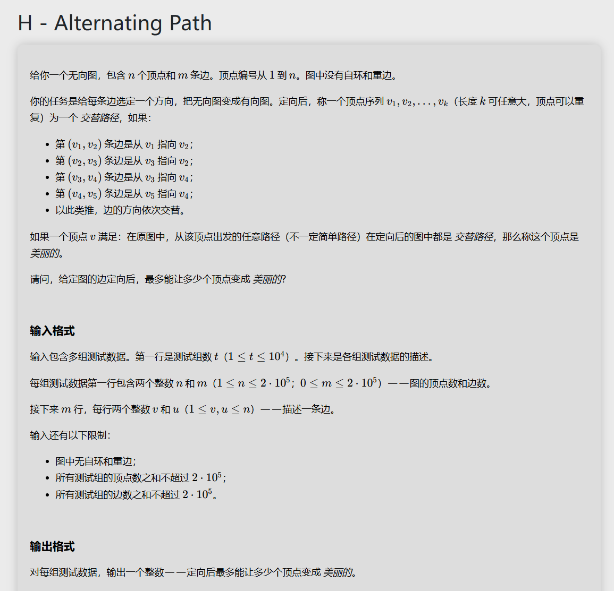

# 代码
```
#include<bits/stdc++.h>
using namespace std;
#define MAX 200050
vector<int> a[MAX];
vector<int> color (MAX,-1);
void solve(int i,int* cot,int* label){
	for(int j=0;j<a[i].size();j++){
		if(color[i]==color[a[i][j]]){
			*label=-1;
		}
		if(color[a[i][j]]==-1){
			color[a[i][j]]=color[i] ^ 1;
			cot[color[a[i][j]]]++;
			solve(a[i][j],cot,label);
		}
	}
	return ;
}

int main(){
	int t;
	cin>>t;
	while(t--){
		int n,m,max1=0;
		cin>>n>>m;
		
		for(int i=1;i<=n;i++){
			a[i].resize(0);
			color[i]=-1;
		}
		
		for(int i=0;i<m;i++){
			int u,v;
			cin>>u>>v;
			a[u].push_back(v);
			a[v].push_back(u);
		}
		for(int i=1;i<=n;i++){
			int cot[2]={0,0},label=0;
			if(color[i] != -1){
				continue;
			}
			color[i]=1;
			cot[1]++; 
			solve(i,cot,&label);
			if(label==-1){
				continue;
			}
			//cout<<cot[0]<<" "<<cot[1]<<"\n";
			max1+=max(cot[0],cot[1]);
		}
		cout<<max1<<"\n";
		
	}
	
	
	return 0;
}
```

# 思路讲解

画一个图尝试一下可以发现，我们要就是要找对于每个连通分支的与某个点距离为偶数的个数的最大值，这个最大值就是这个连通分支种美丽点最多的个数。

此外我们还可以发现，若某个连通分支有奇回路，那么这个连通分支将不可能有美丽点。

根据以上两点，我们不难想到就是首先判断这个图是否为二分图，然后再计算每一部分点个数的最大值，每个连通分支累加。因此我们可以通过dfs或者bfs写这个代码来实现。