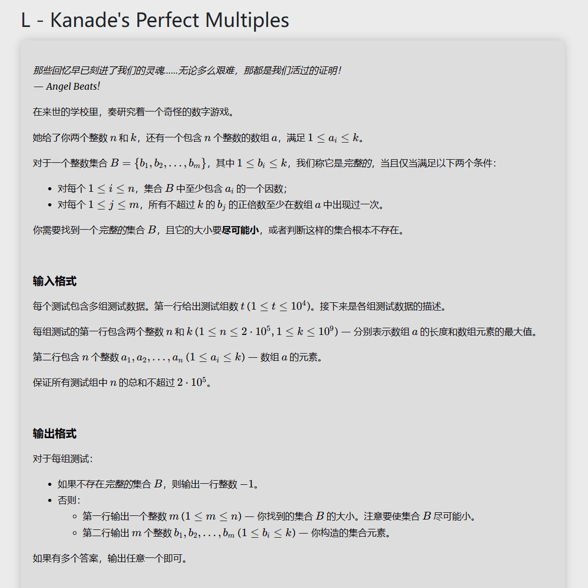

# 代码
```
#include<bits/stdc++.h>
using namespace std;
set<long long> s,uncovered;
vector<long long> ans;
long long n,a,k;
void solve(){
	s.clear();uncovered.clear();ans.clear();
	cin>>n>>k;
	for(int i=0;i<n;i++){
		cin>>a;
		s.insert(a);uncovered.insert(a);
	}
	while(!uncovered.empty()){
		long long x=*uncovered.begin();
		if(k/x>(long long)s.size()){
			cout<<-1<<"\n";
			return ;
		}
		int c=1;
		ans.push_back(x);
		while(x*c<=k){
			if(s.find(x*c)==s.end()){
				cout<<-1<<"\n";
				return ;
			}
			else{
				uncovered.erase(x*c);
				c++;
			}
		}
	}
	cout<<ans.size()<<"\n"; 
	for(int i=0;i<ans.size();i++){
		cout<<ans[i]<<" ";
	}
	cout<<"\n";
	return ;
		
}
int main(){
	int t;
	cin>>t; 
	while(t--){
		solve();
	}
	
	
	
	return 0;
}
```
# 思路讲解
我们可以发现，$B$  中的所有元素都应该在 $A$ 中，因为1倍数肯定小于 $k$ ,并且，其他的倍数一定比1倍数要大。而且若其倍数也在 $B$  中，那么倍数一定可以去掉，因此我们可以从小往大枚举，其小于 $k$ 的倍数一定要在 $A$ 中，然后枚举下一个没有被覆盖掉的内容加入 $B$ ，直到枚举完所有内容。

而枚举从小到大枚举，但是覆盖是无序的，因此我们就使用STL中的有序集合来缩小时间复杂度。


# 知识点STl
[C++：set、map的使用及其特性和区别_c++set和map的区别-CSDN博客](https://blog.csdn.net/ETalien_/article/details/89439892)
[STL 竞赛向快速入门](https://www.yuque.com/ericxie_xtu/acm_course/stl)
## set集合

## map字典

## pair有序对

## vector向量

