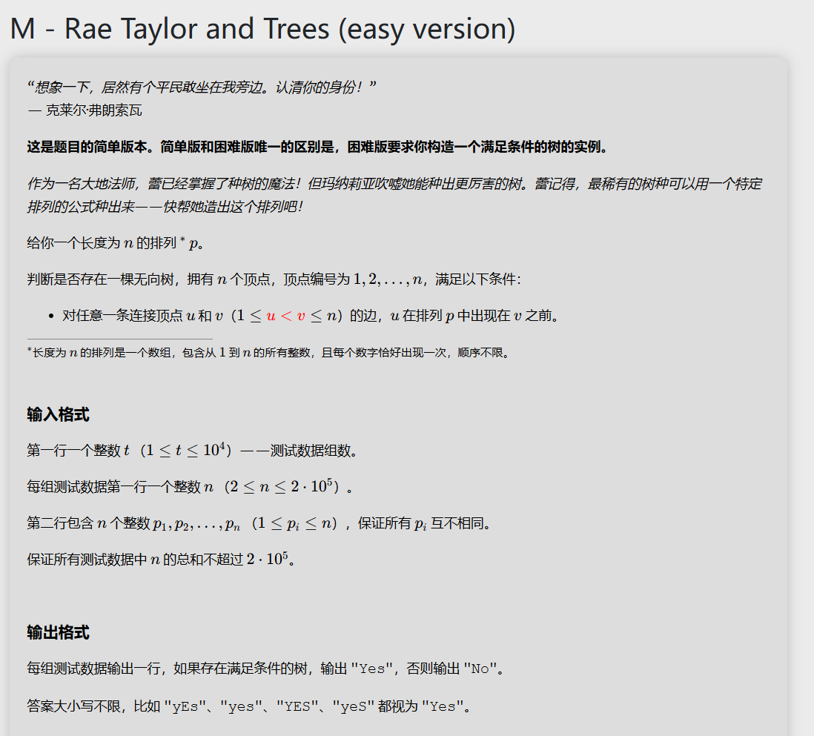

# 代码
```
#include<bits/stdc++.h>
using namespace std;
int a[200050],max1[200050];
int main(){
	int t;
	cin>>t;
	while(t--){
		int n,ans=0,min1;
		cin>>n;
		for(int i=0;i<n;i++){
			cin>>a[i];
		}
		max1[n-1]=a[n-1];
		for(int i=n-1;i>0;i--){
			max1[i-1]=max(a[i],max1[i]);
		}
		min1=200050;
		for(int i=0;i<n;i++){
			min1=min(min1,a[i]);
			if(max1[i]<min1){
				ans=-1;
			}
		}
		
		if(ans==0){
			cout<<"YES\n";
		}else{
			cout<<"NO\n";
		}
	}
	
	
	
	return 0;
}
```

# 思路讲解

我们可以发现，只要序列后方有比前面的所有的值都要大，那么前面的所有值都可以与他形成符合条件的树。

但是对于每一个分割线都去向左向右枚举的时间复杂度为 $O(n^2)$ 这是不能接受的，于是我们可以先预处理一个后缀最大值，然后再从前往后遍历即可。