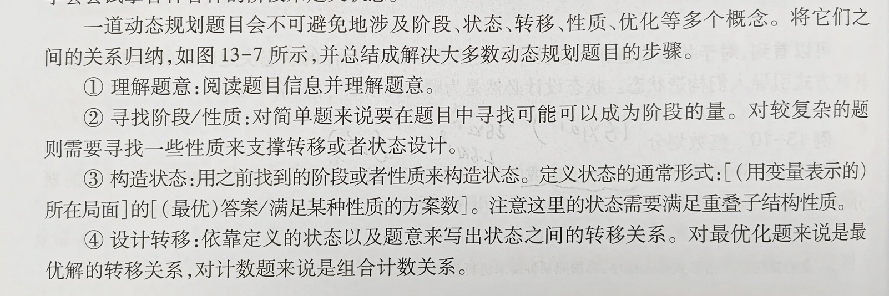
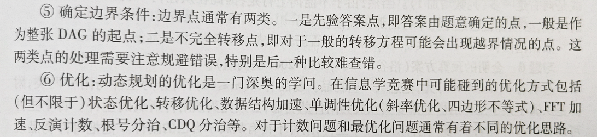
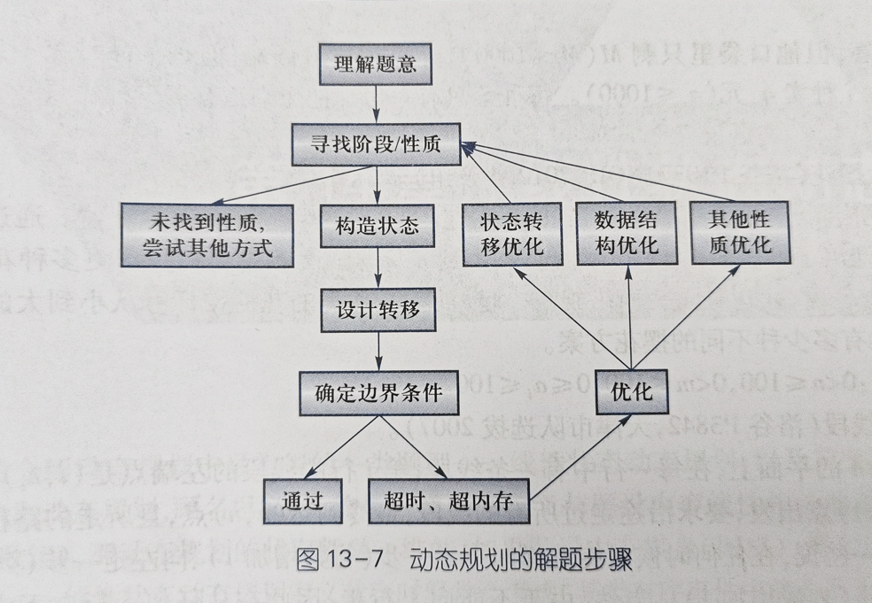
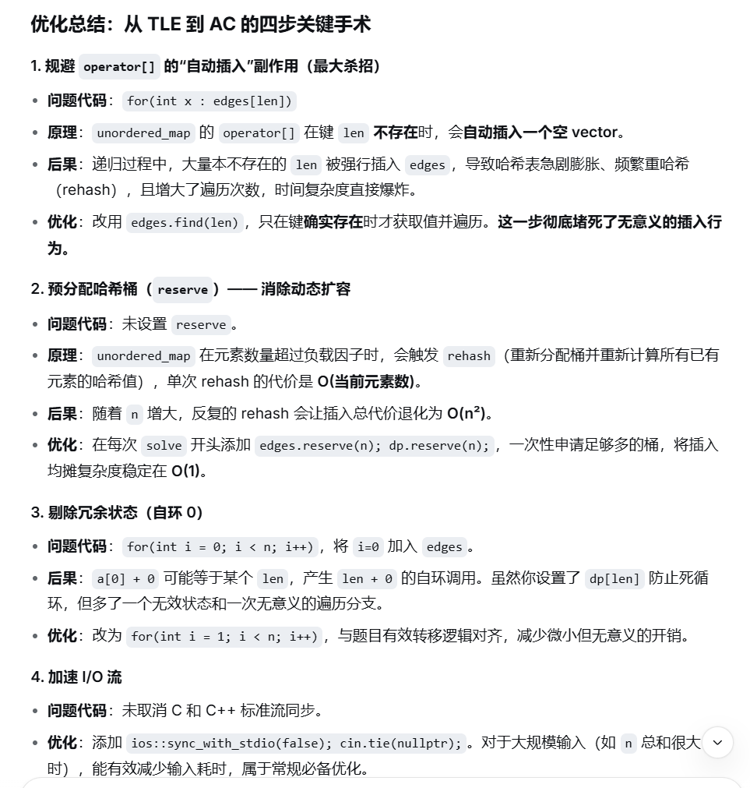
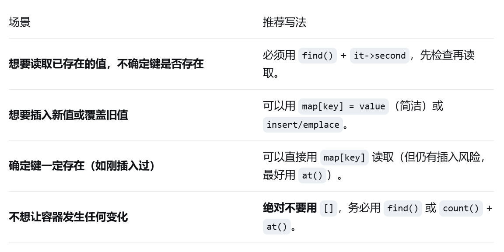

# 基本概念
## 核心思想
带有重复子问题的dfs，通过存储子问题的答案来节省遍历时间和复杂度。
## 状态、转移、有向无环图
1.状态：可以是当下的情况，可以是任何情况，比如说当前最多的选择数，当前最少的步数等等，一般都是当前的最优答案。DP是不断分成子问题，所以是得到子问题最优解，因此状态要包含子问题最优解的答案。
2.转移：其实就是如何合并子问题的过程。我们已经知道了子问题的答案，那么我们该如何得到主问题的答案。
3.DAG有向无环图：其实就是无后效性的等价性质，前面已经求出来的答案不会在更改
# 典型例题
方法：
1. 先找有没有明显的阶段
2. 观察是否有无后效性的分成子问题的方案
3. 思考状态与状态转移方程
4. 得到遍历方向




## 纸币问题
问题描述：问凑齐金额w的纸币分配方案/最少张数
题解：可以通过现得到能到达这个状态的前状态（w-a\[i\]）的种数，全部加起来即可得到。
定义状态 $f_{w}$  为金额为w时的所有种数
状态转移方案：
$$
f_{w}=\sum^{n}_{i=1}f_{w-a[i]}
$$
从小往上遍历即可先得到子问题的答案，然后再得到主问题的答案。

## 最大连续子段和
问题描述：给你一个数组，求最大的连续字段和
题解：明显的阶段只有序列，思考从最小的数列往后加。但是这样我们不知道往后加的时候能否连续，因此选择状态为以 i 结尾的最大子段和，那么 i+1 的最大子段和只有两种可能：
1. 把 i+1 连在 i 后面
2. i+1 单独一段
定义状态：$f_i$ 为以 i 结尾的最大子段和
状态转移方案：
$$
f_i=max(f_{i-1}+a_i,a_i)=max(f_{i-1},0)+a_i
$$
## 整数拆分
问题描述：将n<50000划分为若干不同的整数的和，求可能的方案
题解：现尝试把小于n的整数加入集合，然后得到用集合内的整数把所有数拆分的可能性，双层遍历，时间复杂度 $O(n^2)$ 不能接受。
观察到 $\sum^{316}_{i=1}=50086>50000$ 因此我们可以遍历有多少个不同的整数这样我们的复杂度就是 $O(n\sqrt{n})$ 勉强能接受。
那么我们怎么去转移呢？因为他是存储了不同整数的个数，不知道有谁在里面，所以不能直接选择数加入（我们也不会这样，因为这样就和上面的一样了），因为他们本来就不同，那么我们就选择把这些不同的数+1，可以选择补1或者不补，那么就有两种分配方式得到了，直观理解方案的生成方式是发送式，参考代码
```
vector<vector<int>> dp;  
dp[0][0]=1;  
for(int i=1;i<=317;i++){  
    for(int j=1;j<=n;j++){  
        dp[i][j+i]+=dp[i][j];  
        dp[i+1][j+i+1]+=dp[i][j];  
    }  
}
```
但是这样可能导致越界，我们思考一下接受式
```
vector<vector<int>> dp;  
dp[0][0]=1;  
for(int i=1;i<=317;i++){  
    for(int j=i;j<=n;j++){  
        dp[i][j]=dp[i][j-i]+dp[i-1][j-i];  
    }  
}
```

其实这个补与不补也是在遍历1-n 中的数是否选择。

## 线段
题目描述：找到经过每条线段的最小路径。
条件：每行只有一条线段，不能往上走
题解：因为不能往上走，所以无后效性。然后可以发现如果要最短路径，那么在这一行应该刚好走到一个端点式最段的。那么在处理第 i 行时，我们 i-1行只会停留在左端点或者右端点。那么我们就分别对第 i 行的左右端点更新状态。
当处理左端点时，最短路径肯定是从右端点过来的，那么就找从第 i-1 行到右端点的最短路径，然后更新左端点，右端点类似。
核心代码
```
vector<int> l(n+1),r(n+1),len(n+1),dpl(n+1),dpr(n+1);  
    for(int i=1;i<=n;i++){  
        cin>>l[i]>>r[i];  
        len[i]=r[i]-l[i];  
    }  
    dpl[1]=r[1]+len[1]-1;dpr[1]=r[1]-1;  
    for(int i=2;i<=n;i++){  
        dpl[i]=min(dpl[i-1]+abs(l[i-1]-r[i]),dpr[i-1]+abs(r[i-1]-r[i]))+len[i]+1;  
        dpr[i]=min(dpl[i-1]+abs(l[i-1]-l[i]),dpr[i-1]+abs(r[i-1]-l[i]))+len[i]+1;  
    }  
    cout<<min(n-l[n]+dpl[n],n-r[n]+dpr[n])<<"\n";
```


# 记忆式搜索

# 背包DP
## 01背包
01背包是指对于每个物品只有选与不选两种情况，我们该如何拆分为子问题呢？

我们可以发现设 $f_{i,j}$ 是指我们已经安排好了前 $i$ 个物品，然后在剩余空间为 $j$ 的情况下可以拿到的最大价值。

然后我们可以选择第 $i+1$ 物品的拿与不拿两种情况。
如果不拿，那么 $f_{i+1,j}=f_{i,j}$ ;
如果拿，那么剩下空间就为 $j-w_{i+1}$ 然后当没有考虑第 $i+1$ 个物品的时候剩下空间的最大价值就是$f_{i,j-w_{i+1}}$ 因此 $f_{i+1,j}=f_{i,j-w_{i+1}}+v_{i+1}$ 

状态转移就写出来了
$$
f_{i,j}=max(f_{i-1,j},f_{i+1,j-w_i}+v_i)
$$

然后我们选择对 $i$ 一个一个遍历，可以得到
```
for (int i = 1; i <= n; i++)
  for (int l = W; l >= w[i]; l--) 
	  f[l] = max(f[l], f[l - w[i]] + v[i]);
```
最后答案就是f\[w\]

## 加零
题目描述：对于下标 i 满足 $a_i=|a|+1-i$ ，可以在末尾加 $i-1$ 个零
题解：有一个很明显的阶段，每次加完零后可以加的零会变化，因此先写一个dfs
```
long long dfs(long long n,long long len,vector<long long> a){
	long long ans=len;
	for(int i=1;i<n;i++){
		if(a[i]+i+1==len+1){
			ans=max(ans,dfs(n,len+i,a));
		}
	}
	return ans;
}
 
void solve(){
	int n;
	cin>>n;
	vector<long long> a(n);
	for(long long &x:a){
		cin>>x;
	}
	cout<<dfs(n,n,a)<<"\n";
	
}
```
代码没问题，但是在第五个数据点就超时了。
思考优化：我们可以发现len在每一个阶段之后都只增不减。
那么我们就定义状态为当前长度。状态转移就是满足 a\[i\]+i 的 i ，方程如下：
$$
dp_{len}=\max\{len ,\max_{i\in dege[len]}{dp_{len}}\}
$$

其中 dege\[len\]是只长度为len时可以往后加入的零。
然后我们在dfs里采用记忆式搜索。
```
vector<long long> a;
int n;
unordered_map<long long,vector<int>> edges;
unordered_map<long long,long long> dp;

long long dfs(long long len){
	if(dp.find(len)!=dp.end()){
		return dp[len];
	}
	dp[len]=len;
	auto it=edges.find(len);
	if(it != edges.end()){
		for(int x:it->second){
			dp[len]=max(dp[len],dfs(len+x));
		}
	}
	return dp[len];
}

void solve(){
	cin>>n;
	a.resize(n);dp.clear();edges.clear();
	dp.reserve(n);edges.reserve(n);
	for(long long &x:a){
		cin>>x;
	}
	for(int i=1;i<n;i++){
		edges[a[i]+i].push_back(i);
	}
	cout<<dfs(n)<<"\n";
}
```

### 代码优化方案：

我自己总结一下就是
1. 在map中操作符【】会引入新键，会导致map中元素增多，因此会导致查找变慢。因此先查找是否存在，再访问。
2. 往map中加入大量元素会导致rehash，因此在知道长度时可以先resever（重新定义长度），再加入元素。
3. \[\]与迭代器的区别

# 线性状态的动态规划
## 最长不减子序列问题LIS
线性状态表示：$f_i$ 代表以 i 结尾的最长最长不减子序列的长度。
状态转移：
$$
f_i=\max_{j<i 且 a_j\geq a_i} \{ f_j\}  + 1
$$

便可以得到时间复杂度为 $O(n^2)$ 的算法。