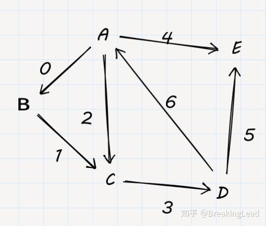
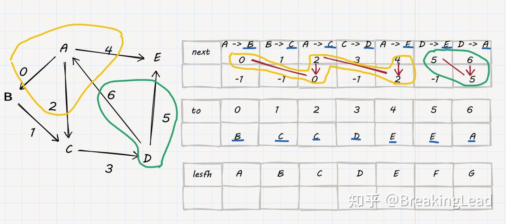

本质就是存了一组变的数组，用to只想边指向的点V，用next指向与此同起点的边E。

这样用链表存储同一个点的出边，更好遍历；
比邻接表更加省内存，只有3\*n的大小；并且比邻接矩阵更加快速；




next\[i\] ：与编号为i的边同一个起点的下一个边的编号。
to\[i\]： 编号为i的边的终点。
lesfh\[i\]：以编号为i的点为起点的最后一条边。

注：可以以编号-1为遍历完了同起点的出边


定义代码
```
int lesfh[MAXM];  
ll cnt=0;  
  
struct egde{  
    int to,next;  
}egdes[MAXM];  
  
void add_egde(int from,int to){  
    cnt++;  
    egdes[cnt].to=to;  
    egdes[cnt].next=lesfh[from];  //插入边
    lesfh[from]=cnt;  //更新最后一个from出来的边
}
```

遍历代码
```

```