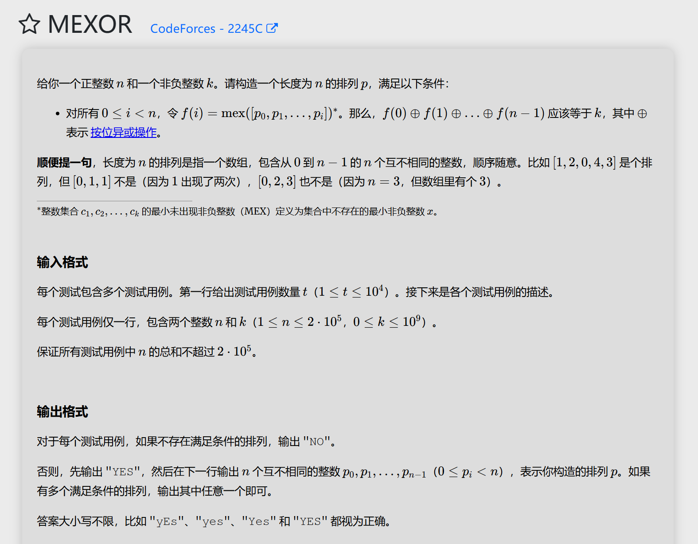

# 代码
```
#include<bits/stdc++.h>
using namespace std;
int len(long long n){
	int count=0;
	while(n!=0){
		n/=2;
		count++;
	}
	return count;
}
int main(){
	int t;
	cin>>t;
	while(t--){
		int n;
		long long k,k_;
		cin>>n>>k;
		k_=k^n;
		if(len(k_)>len(n-1)){
			cout<<"NO"<<"\n";
		}else{
			cout<<"YES"<<"\n";
			if(k_==0){
				for(int i=0;i<n-1;i++){
					cout<<i+1<<" ";
				}
				cout<<"0"<<"\n";
			}else if(k_<=n-1){
				for(int i=0;i<n;i++){
					if(i!=k_&&i!=0){
						cout<<i<<" ";
					}
				}
				cout<<0<<" "<<k_<<"\n";
			}else if(k_>n-1){
				long long v=k_^(n-1);
				for(int i=0;i<n;i++){
					if(i!=n-1&&i!=v&&i!=0){
						cout<<i<<" ";
					}
				}
				cout<<0<<" "<<v<<" "<<n-1<<"\n";
			}
		}
	}
	return 0;
}
```